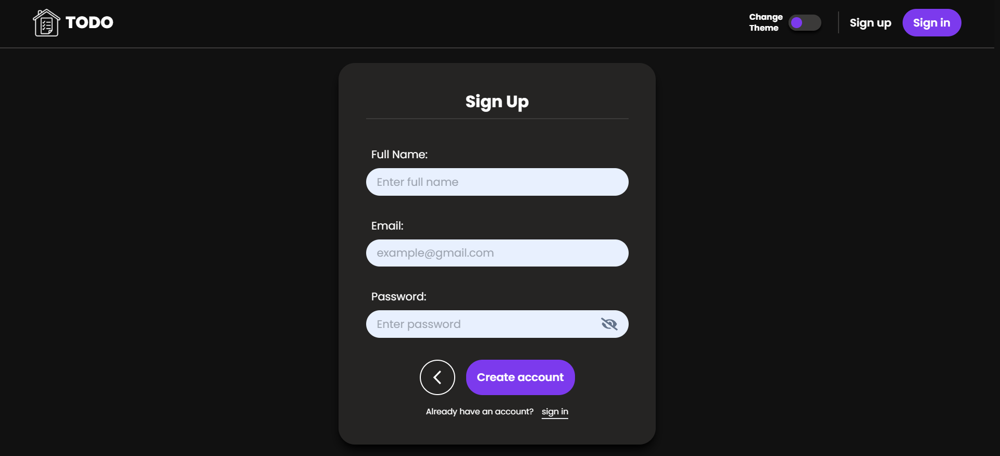

# Todo app with appwrite

- This is a fullstack project. In this project I have made a **Todo App** with React and Appwrite, which can perform all CRUD operations.

- I have hosted this website on netlify, please find the link below:

  

---

## 🚀 Features

- Authentication
- Create, edit, delete and read todos.
- Create, edit, delete and read tasks.
- Mark important tasks.
- Progress bar to see your progression.
- Responsive for small and medium screens.
- Todo and tasks timestamp.
- Available in Dark and light mode.
- Can set todo theme.

---

## 🛠 Skills learned

- To use Appwrite
- To use react router dom
- To use react hooks

---

## 💻 Technologies used

- React.js for frontend
- React router dom for client side routing
- Appwrite for database
- Framer motion for some animations.

---

## 🎥 Screenshot

---

## 👨‍💻 About Me

### Hey, I am Yasir lambawala

- I am a frontend developer from Gujarat. I have done my Btech at GTU university and I am currently learning backend-development.

---

## Feedback

- If you have any feedback, please reach me at lambawalay@gmail.com
